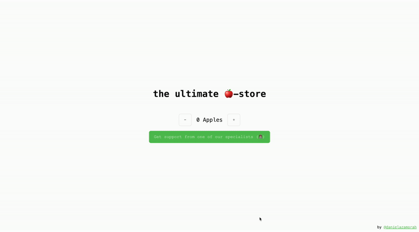
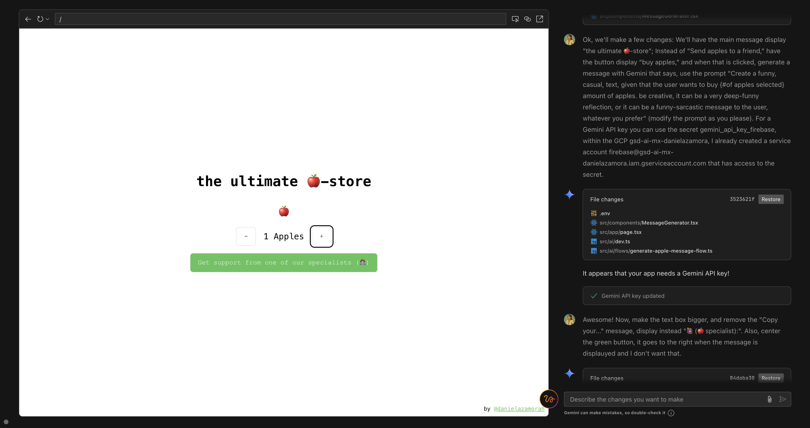

> My first web app, woohoo. Week 1 of learning about it.

# The ultimate 🍎-store
The mega, super, ultra original idea of... an apple store (inside joke with my cool web-dev spiritual guide).

## Blueprint

Blueprint of web app, developed side by side with [Firebase Studio](https://firebase.google.com/)'s AI prototyping Agent. 

How the development excperience looks like:

You can also switch to a VSCode-like interface to edit the code directly.

### Core Features:

* **Title Display:** Display a title "the ultimate 🍎-store" at the top of the page.
* **Apple Counter with Icons:** Display a counter with `-` and `+` buttons to adjust the number of apples. The current count is displayed between the buttons. A row of apple icons representing the current count is displayed above the counter.
* **Message Trigger Button:** Create a button that when clicked,  reveals a personalized message below it (generated with the [Gemini API](https://aistudio.google.com) through [GenKit](https://firebase.google.com/docs/genkit?hl=es-419)).
* **Message Display:** Display a personalized message based on the number of apples.
* **Creator Tag:** Display a small link to my Linkedin page at the bottom right corner of the page.

### Style Guidelines:

* **Background color:** White (`#FFFFFF`) for a clean and minimalist look.
* **Font:** Typewriter-like or monospaced font for all text elements.
* **Apple Icons:** Simple red apple fruit icons (🍎) that change with the selected number of apples.
* **Color Scheme:** The application primarily uses black text and elements on a white background.
* **Accent Color:** A light green color (`#90EE90`) is used for the "Get more apples, or apples" button. The `-` and `+` counter buttons are black text on a white background.

### Original User Request (to AI prototyper 🤖):

    A simple web app, minimalist, typewriter-like font, white background, has an apple simple icon in the middle, apple the fruit, not the product, and it has a counter button down to add or remove the number of apples you want to add to the page. the only other element in the web page is a button that says: "send apples to a friend", which creates a message that the user can copy that says "Hola tu, here are {x} apples, just because." Yes, I know it's a silly app, but I want to do it anyways. You can close the message and start again. It has a text, small, below, that says "by danielazamorah."

👆🏼 This changed because I wanted to have AI-generated messages to learn how to use GenKit (to connect by app to the Gemini API easily).